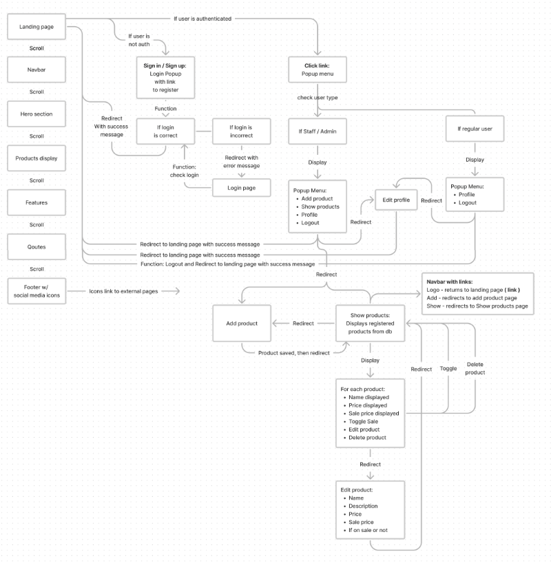
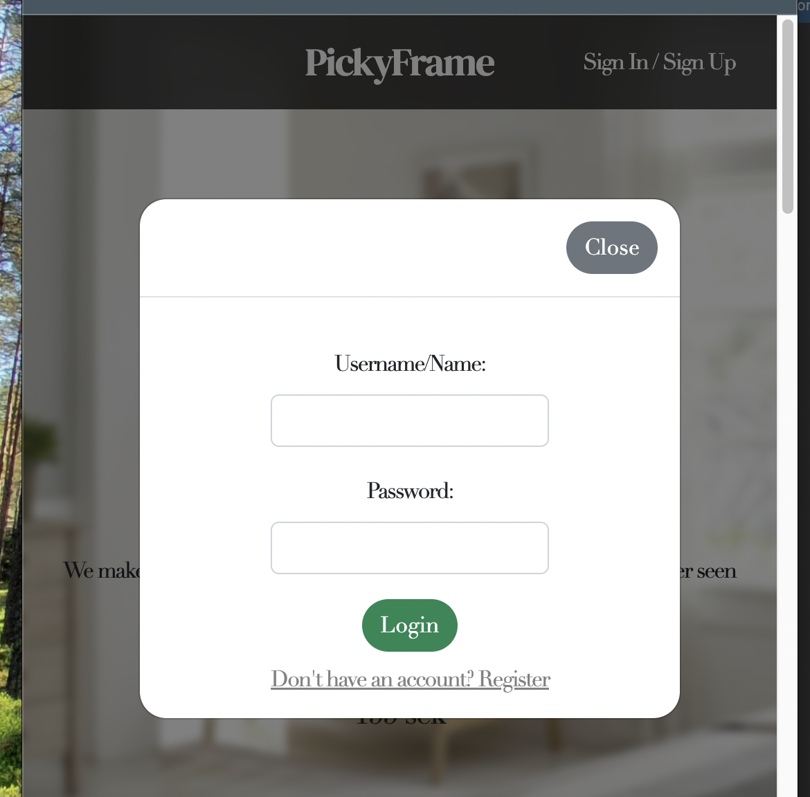
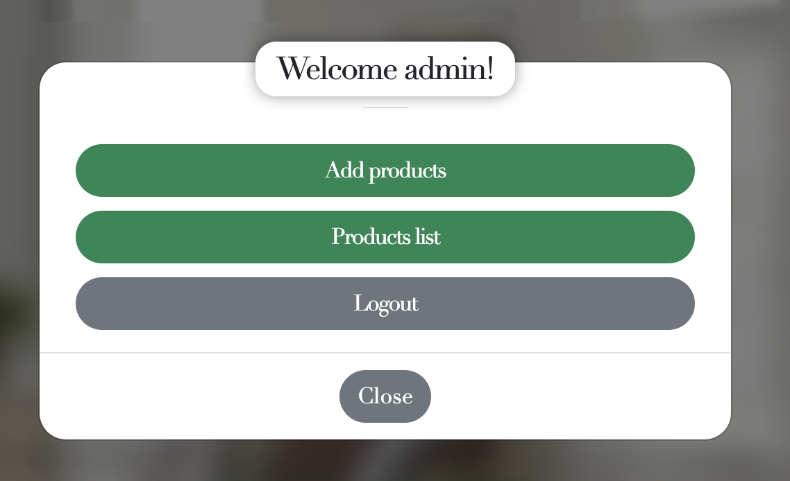
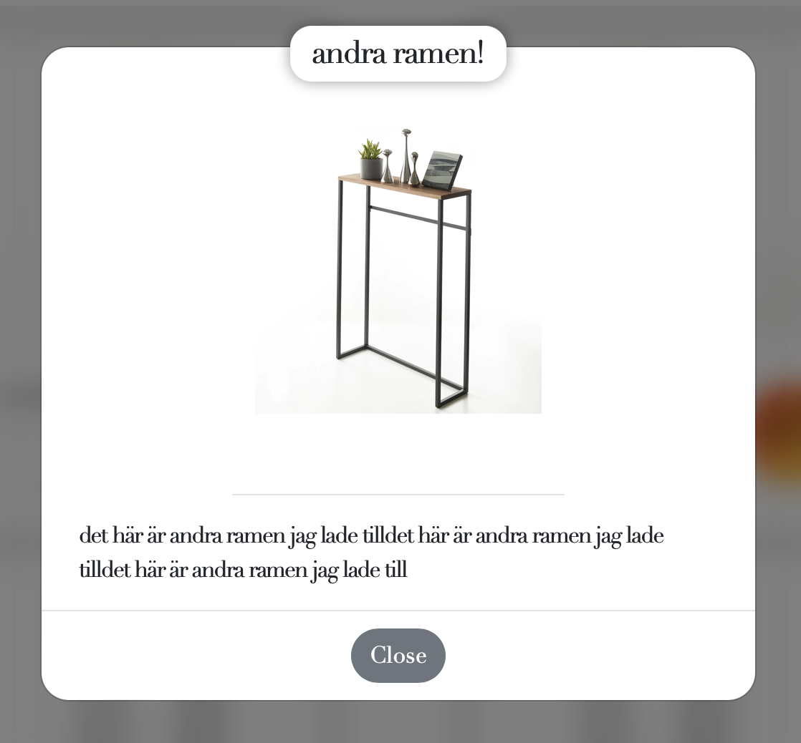
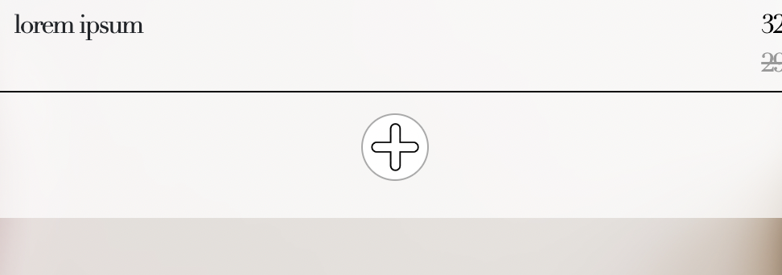
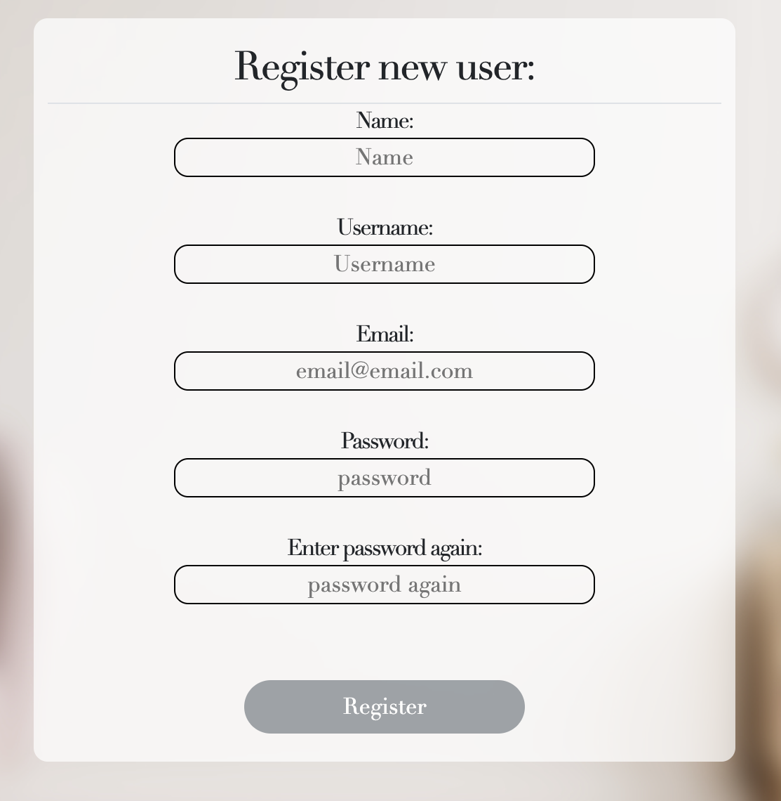
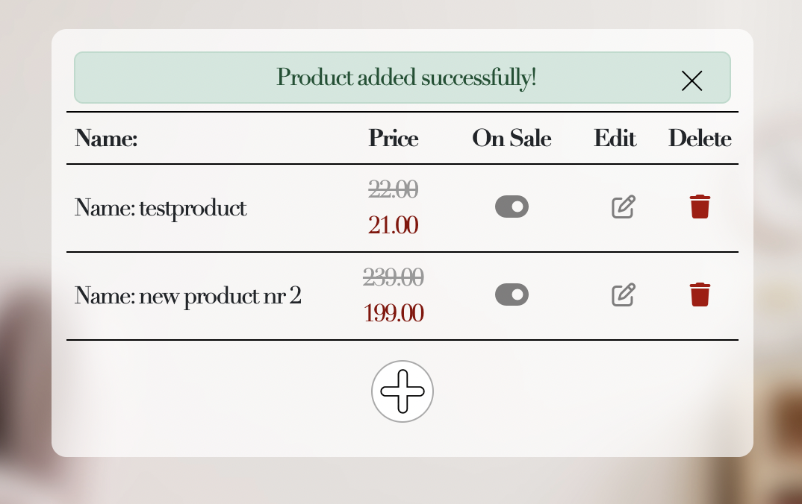

# pickyproducts
Django project CMS for CRUD operations regarding PickyFrame

> 1. [X] [What is it](#what-is-pickyproducts)
> 2. [X] [UI & UX](#UI-&-UX)
> 3. [X] [Features and pages](#features-and-pages)
> 4. [X] [Installing Django](#install-django)
> 5. [X] [Showing items from db](#showing-items-from-dbproducts)
> 6. [X] [Adding Item to db](#adding-items-to-db)
> 7. [X] [Updating Item in db](#updating-items-in-db)
> 8. [X] [Deleting Item from db](#deleting-item-from-db)
> 9. [X] [Testing](#testing)
> 10. [X] [Deployment](#deployment)
> 11. [X] [Tech](#technologies) 
> 12. [X] [Support](#support)

## What is PickyProducts?

PickyProducts is a Fullstack project from me, Thomas Forselius; a '22 season student at CodeInstitute front end developer course. 
The project has admin/crud capabilities for managing products in a database, and then the products are displayed on the main page. 

The idea and goal with this project is to implement it into my upcoming website that is in the works and will be launched later in the year. 
It will have a webshop that will utilize the same products and database as this project. It's so much more enticing to acutally code a project that will be used in a real world scenario. This keeps the life of the project fresh!

The idea with this website is to make it a template for an easy webpage with user registration and product management via a login as Admin/Staff.

The page can be forked/cloned and used for other products, simply by changing the logo, background image and descriptive text on the page. There is no need to make any other changes to the back end code other than some basic settings like db, title, static folder etc.

## UI & UX

- On of the most important features of webpages today is being responsive, since the largest amount of people view webpages on their mobile devices. Responsive websites are a must, if your goal is the keep the interest of the visitor
- My idea when creating this page is that I wanted to simple and esthetically pleasing design without too much flashy functions and design elements that draw attention away from the product itself. 
- Colors used are simple - I wanted to keep it simple with a high contrast for maximum accessibility; 
    - Black text on white background, great contrast and very relatable color combination
    - Soft beige color palette, the go-to-choice for vloggers, bloggers and interior design photographers. "Know your target audience"
    - The green details and accent colors are a good and simple way to create a subtle colorful feel on the page without spoiling the laid back feeling from the beige

### Wireframe

- Mobile wireframe: 


- Desktop wireframe


### Logic Diagram

Below is the login mapping of the page and its pages.


### Typography

- The fonts I have chosen are serif, to give a sense of 'classic' and 'elegance'
    - Font 1: Didot
        - This is the main font for the whole page
        - Link: https://www.cufonfonts.com/download/font/single/97226/didot-2
    - Font 2: DM Serif Display
        - This is the font for the logo
        - https://fonts.google.com/download?family=DM%20Serif%20Display

### Images

- The background I chose for the landing page is a casual but styled living room. The image is blurred to keep the users intrest focused on the logo or product. Otherwise the background can become to distracting and draw attention away from the real point of intrest
- It just as well on large devices as well as mobile devs.
- THe design is done from 'Mobile first' mindset, but adapted to work on larger screens as well thanks to resposive design media queries
- The page i use for free images is Freepik, https://www.freepik.com/

### Icons

- The plus sign icon under the products list page is downloaded from: 
    - https://www.flaticon.com/free-icon/add_992651?term=plus&page=1&position=5&page=1&position=5&related_id=992651&origin=search
- The profile icon at the right in the navbard when logged in is from fontawesome: 
    
    - Display the icon by using the following html code, retrieved from the www.fontawesome.com homepage:
    ```html
    <i class="fa-regular fa-user mx-2"></i>
    ```
- The like button is a heart
    - If the product has not been liked by the user it is green without fill
    - If the product has been liked by the user it is red
    

    ```html
    <i class="fa-regular fa-heart"></i>
    ```

## Features and pages

### Navigation

The navigation is a simple nav-bar at the top of the page with only 2 clickable links: 

- Logo: clicking here returns the user to the default page
- At the top right: 
    - If you are not yet signed in, you can sign up or sign in. 
        - Clicking this shows a popup where you can enter login credentials or click to go to the register page
        
    - If you are signed in, you will have a 'profile' icon and your name next to it.
        
        - Clicking this shows a popup with your username at the top
            - If you are logged in as admin, you get three links: 
                - Add products - redirects you to a page where you can add new products
                - Show products list - redirects you to a page that handles crud operations of the products on the page
                - Logout
                
            - If you are logged in as a regular user, you only get one link at the moment: 
                - (coming feature) Profile page
                - Logout
    - If you try to login with a faulty/non existing username, you will be prompted with the following message:
    
    - If you try to login with the wrong password-to-username, you will be prompted with the following message: 
    
- The only (at the moment) clickable component on the page is each product, where when you click 'View product' a modal popup will appear showing the selected products information


- Trying to access a page that doesn't exist redirects you back to the homepage and displays an error message:


- Adding products from the product list in admin section, uses the icon below: 
     - https://www.flaticon.com/free-icon/add_992651?term=plus&page=1&position=5&page=1&position=5&related_id=992651&origin=search
     

### Landing page

- Landing page: the default page you will view products at
    - (at the moment there is only view functionality for the products, unless you are admin/staff)
    - When scrolling through products you can click 'view frame' to open a popup with more informaiton regarding the chosen product
- Register page: if you don't have an account, this is were you register as a user
    
    - To ensure names are stored correctly, there is a javascript running to replace all non-letter characters from the input value.
    ```javascript
        const name = document.getElementById("name");
        name.value = name.value.replace(/[^a-öA-Ö]*$/g, "");
    ```
    - If the value of name is shorter than one letter, the input box will turn red
    ```javascript
        if(name.length < 1){
            name.className = "error";
        }
        else{
            name.className = "pass";
        }
    ```
    - To ensure correct registration details, there is a javascript running to check if password1 and password2 match. As long as they don't match, the register button will be disabled and a small alert will cover it
    ```javascript
        password2.addEventListener('keyup', (event) =>
            {
                if(password2.value != password1.value){
                pass_check.innerText = "Passwords do not match";
                pass_check.className = "alert alert-danger";
                document.getElementById("submit").disabled = true;
                }
                else{
                pass_check.innerText = "";
                document.getElementById("submit").disabled = false;
                pass_check.className = "";
            }
    ```
    

- Login page: this is where you login when you have registered

- The basic feature of the webpage is a user friendly product management system where you can register as a user. 
- Admins/Staff are added either through the django-admin terminal commands or via the integrated web-ui @ 'webpage'/admin
    - As an admin, you can create, read, update and delete products, by using the top right menu when logged in to access the admin section of the products page
    - Add products page
    
    
    - Deleted product
    
    - Update / Edit product

- There are 4 main sections to the landing page: 
    - Hero section
        - This is the first thing the visitor sees when entering the webpage. 
        - There is a short text description as well, with a catchy slogan, to invoke a positive feeling
        - Here there is a cta(call-to-action) button where you get a modal popup with a nice product view to quickly get a good idea of what the page is about.
    - Products
        - This section displays all the products that we have to offer on the webpage, each on a separate 'card'
    
    - Features
        - This part of the pags will have a list of features of the products that we have to offer. 
    - Qoutes from users
        - At the bottom of the landin page there is a section where you can read what other users have said about the products. A future feature could be that registered uses can leave ratings and qoutes about the products, and that they are stored in the database. 
        Then those qoutes are loaded into the qoutes section of the landing page dynimcally, displayed with a carousell. 

- Like products
    - Each product has a like button and a like counter that displays the amount of users have liked the product
    - The like button is only available to click if the user is logged in
    

### Footer

At the bottom of the page is the footer. 
Here there are social media icon links and an adress 


### Future potential features

- Users posting qoutes about the products > qoutes are displayed in carousel at the bottom of the landing page
- Users posting ratings of the products > shown with stars on each product card
- News letter that emails registered users with deals and new products

## Install Django: 

These are the installing and deployment steps for starting and running a Django project:

- to get the latest verion before 4, since 4 is not long term supported
-   ```
    pip3 install 'django<4'
    ```
- starts a new django project with the name 'pickyproducts'
-   ```
    django-admin startproject pickyproducts .
    ``` 
- starts a new django app with the name 'productsadmin'
-   ```
    python3 manage.py startapp productsadmin
    ```
- starts the django server
-   ```
    python3 manage.py runserver
    ```
- creates basic databases
-   ```
    python3 manage.py migrate
    ```
- creates superuser in db
-   ```
    python3 manage.py createsuperuser
    ```
- Create/update db model in *models.py* / this is where you design your model structure
    sets up new model for db, ready for migration
-   ```
    python3 manage.py makemigrations
    ```    
- creates new migration in db / creates tables and relations
-   ```
    python3 manage.py migrate
    ```

- Open admin.py and add: 
    -   ```python
        from models import Product
        ````
        Note: Product is the name of the table created in *models.py*
    - further down, add the following: 
        -   ```python
            admin.site.register(Product)
            ```

### Showing items from db: 

- In *views.py* , add a new class using the following lines:
    -   ```python
        def show_prod(request):
            products = Product.objects.all()
            context = {
                'products' : products
            }
            return render(request, 'admin/show_prod.html', context)
        ```
        *the variable 'products' is what you use to show products in show_prod.html, by using a for-loop to iterate through*.
        
        *i.e. *

- In *urls.py*, add the following information: 
    -   ```python
        from productsadmin.views import show_prod 
        ```  
        *show_prod* is the name of the class defined in *views.py*
    - in urlpatterns, add the following:
        -   ```python
                path('', show_prod, name='show_prod')
            ```

- Now go to your local server and add '/admin' in the address field to access admin panel
- Login using the superuser credentials you created earlier
- Under the Users table, Products should appear
- To make added items display names instead of 'Item #number' in products table the following line has to be added to *models.py*:
    -   ```python
            def __str__(self):
            return self.name
        ```

- In the file show_prod.html, use this code to iterate through the dictionary of items imported from the view.py file:
    -   ```python
         
        ```
    - Now in this for-loop you can use *product.name, product.id, product.price and so on to display eache key value*

### Adding items to db:

To add items to the database you need to add a frontend page by following these steps:

- In *views.py* add the following:
    -   ```python
        def add_prod(request):
            if request.method == "POST": 
                name = request.POST.get("name")
                price = request.POST.get("price")
                desc = request.POST.get("desc")
                sale = 'sale' in request.POST
                sale_price = request.POST.get("sale_price")
                Product.objects.create(name=name, price=price, desc=desc, sale=sale, sale_price=sale_price)
                return redirect('show_prod')
        return render(request, 'admin/add_prod.html')
        ```
        This will define a function called add_prod
- In *urls.py*, add the following information behind *from productsadmin.views import show_prod*: 
    - add_prod / 'add_prod' is the name of the class defined in 'views.py'
    - in *urlpatterns*, add the following:
        -   ```python
                path('add', add_prod, name='add_prod')
            ```
- In the */templates/admin/* folder, create a new page called "add_prod.html"
- In the *add_prod.html* page, add your boilerplate html code and form with corresponding input fields to match your product model
- Now when you click sumbit, the field values will transfer to the *views.py* file and be inserted into the db
- You will then be redirected back to *show_prod.html* where the newly added product should appear

- Another way to add a product to the database is to go to the products list, when you are logged in as an admin:
    - Navigate to the products list either by the modal popup at the fron page or in the admin section. 
    - At the bottom of the page there is a Plus icon

### Updating items in db

- In *views.py*, add the following information behind *render, redirect*: 
    -   ```python
            get_object_or_404
        ```
        *this function imports the product form the db using the prod_id as a primary key*
- In *views.py*, create a new function called edit_prod with the following code:
    ```python
    def edit_prod(request, prod_id): 
        prod = get_object_or_404(Product, id=prod_id)
        if request.method == "POST":
            name = request.POST.get("name")
            price = request.POST.get("price")
            desc = request.POST.get("desc")
            sale = 'sale' in request.POST
            sale_price = request.POST.get("sale_price")
            Product.objects.filter(pk=prod_id).update(name=name, price=price, desc=desc, sale=sale, sale_price=sale_price)
            return redirect('show_prod')
        context = {
            'name' : prod.name,
            'price' : prod.price,
            'desc' : prod.desc,
            'sale' : prod.sale,
            'sale_price' : prod.sale_price
        }
        return render(request, 'admin/edit_prod.html', context)
    ```
- In *urls.py*, add the following information behind *from productsadmin.views import show_prod, add_prod*: 
    -   ```python
        edit_prod
        ```
        *edit_prod* is the name of the class defined in 'views.py'
    - In the *urlpatterns* section, add the following: 
        -   ```python
            path('edit/<prod_id>', edit_prod, name='edit_prod') 
            ```
- To make sure that only the selected item in the db is updated, the following code must be added: 
    -   ```python 
        Product.objects.filter(pk=prod_id).update(name=name, price=price, desc=desc, sale=sale, sale_price=sale_price)
        ```
    - the *.filter(pk=prod_id)* part filters out a selected item to be updated via the *.update()* function that follows
- Create a new file called *edit_prod.html*. This wil be a clone of *add_prod.html*, but will populate the fields based on the data that is got from the db.
- To populate the corresponding input field, use the following codes:
    -   ```python
        {{ name }}
        ```
         *imports the value of name*
    -   ```python
        {{ price }}
        ```
        *imports the value of price*
    -   ```python
        {{ desc }}
        ````
        *imports the value of desc*
    -   ```python
        {{ sale_price }}
        ```
        *imports the value of sale_price*
    -   ```python
        {{ sale }}
        ````
        *imports the value of sale*
        
    - Since *sale* is a boolean function, the following if-loop will display a checked checkbox if sale equals True
        -   ```python
            
            <input type="checkbox" id="sale" name="sale" checked>
            
            <input type="checkbox" id="sale" name="sale" >
            
            ```

- Now when you click sumbit, the field values will transfer to the views.py file and be inserted into the db. 
- You will then be redirected back to *show_prod.html* where the newly added product should appear

### Deleting item from db

- In *views.py*, add the following to create a new function called *remove_prod*: 
    ```python
        def remove_prod(request, prod_id):
        prod = get_object_or_404(Product, id=prod_id)
        Product.objects.filter(pk=prod_id).delete()
        return redirect('show_prod')
    ```
- In your show_prod.html, add the following to create a button for the delete function: 
    ```html
        <a href="/remove/{{ product.id }}"><button>Remove</button></a>
    ```
- In *urls.py*, add the following path: 
    ```python
        path('remove/<prod_id>', remove_prod, name='remove_prod')
    ```
- In *urls.py*, add the following path to import view: 
    - After 
    ```python
        from productsadmin.views import ...
    ```
    Add this to import that view: 
    ```python
        remove_prod
    ```

### Fontawesome

To be able to use Fontawesome icons, you need to visit www.fontawesome.com and register for an account, then you can start to use the free icons available on the homepage. 
This code is accuired from your profile page when logged in. 
- Go to Profile -> Scroll down to Kits -> Manage Kits -> Create new Kit -> Click the new kit -> Copy kit code 
- Now add the code to the head of www.base.html (index page):
    ```html
    <script src="https://kit.fontawesome.com/5e9b4b033e.js" crossorigin="anonymous"></script>
    ```
- To find and use icons, go to www.fontawesome.com and search for icons, then copy the *<>* -tag and paste into your webpage.
    *Note, you must have an internet connection for the icon to display since it uses a cdn*

## Testing

- All testing on the page is done manually.
    I chose to do this because of time constraint, and the project is so small, that I could not justify spending that much time on using automated testing for such simple features.

- Links testing: 
    - All links redirect to the correct page
        - External links redirect to a new tab/webpage with the correct target domain
    - Leaves no error messages in console
    - Leaves no error messages on page
    - If the user clicked logout, the page will redirect to landing page and the auth session is terminated/reset, with success message
    - *Sign in / Sign Up* opens the correct modal popup on landing page
    - *profile name* opens the correct modal popup on landing page
    - Logo always returns to landing page
    - Plus-icon on 'Show products page' redirects to 'Add product page'

- Faulty Adresses / Pages
    - All pages and addresses have been tested to show a 404 message/page if they don't exist.
    
- Unauthorised access
    - Trying to access pages that require the correct authorisation without logging in / without proper authorisation redirects to landing page with a message that you are not authorised to view that page
    

- Admin functions
    - Remove product only removes the selected product and nothing else. 
    - Editing and updating a product only updates that specific product and nothing else, using 
        ```python
        .filter(pk=prod_id)' 
        ```
    - Toggling sale price only toggles that product
        - Original price is striked out
        - Sale price is unstriked and displayed in dark red text
        - On the landing page > Products section, the product cards display a red-to-orange fade instead of a white background to display

    - Clicking 'Add' and the 'add product icon' on the 'Show products page':
        - Redirects to a page with a form to fill out with product details
        - Submitting the form only submits one item
        - The fields are filled out with the correct type of information
        - Upon successful submit -> redirect back to 'Show products page' with success message
    - Viewing the newly added item in the products list 
    - Viewing the newly added item in the products section of the landing page

    - Clicking 'Show' on the products list page redirects to 'Show products page'


- Clicking the 'view item' button on products page displays a modal popup with the correct information

- Register form
    - Trying to register withiout filling out the form is not possible
    - Entering an email without proper details
    - Making sure Password 1 and password 2 are the same (this is done using JQuery & Javascript by comparing the two values)
    - If user is registered, they are redirected to landing page with a success message.

- Login testing
    - Entering correct credentials logs the user in and redirects to landing page with success message. 
    At the right in the navbar the user will see their username in green
    
    - If username is incorrect/non existant > They will be redirected back to login page with an error message 
    
    - If the password doesn't match the username > They will be redirected back to login page with an error message
    


### Pep8 testing python code

The following pages and files have been tested using www.pep8online.com:
- Settings.py

- Urls.py

- Admin.py

- Apps.py

- Models.py

- Views.py


### HTML markup check

The following pages and files have been tested using validator.w3.org:
- http://pickyproducts.herokuapp.com
- http://pickyproducts.herokuapp.com/
- http://pickyproducts.herokuapp.com


- Web browser
  - Google Chrome
  - Safari
- Visual 
  - Both HTML structure and CSS styling is tested on each web browser
- Functionality testing
  - Each button is tested
  - Responsive design tested automatically with http://ami.responsivedesign.is
  - Responsive sizing tested manually with Chrome Dev tools Inspector
    - Tablet and desktop version on screen size above 400px wide;
    - Mobile version on screen size below 400px

## Deployment

### Local live server

Building this website I have used VS Code for the coding, while Google Chrome for the visual feedback on a local server extension. 
This lets me test the webpage out before commiting and pushing it to Github for live testing with online extensions and validators like Lighthouse, W3C html validator and W3C CSS validator as well as Javascipt Validator CodeBeautify. 

### GitHub

GitHub is a free git version control online platform for people to upload and share web development projects.
To use github in your local IDE, follow these steps:

- Create a repository on your github account
- Now open your local IDE or online IDE and clone the created repository using the instructions for that specific IDE
- I use VS Code, so I select 'Clone repository' in the file browser window on the left
- Search in the navbar at the top for the name of the repository that you created on github

- When working and saving files, click the 'Source control' icon

- This displayes all the files that have been modified and need to be commited to github
- Enter a commit message and then press 'Commit'
- Now you need to push those changes to github by clicking 'S

### Heroku

- Heroku is a free (until Nov 28'th) webpage where you can host your back end web projects, and connect them to GitHub to make use of front end functionality.

The process of setting up my project on Heroku is the following:

- To be able to connect to our Postrgres database on Heroku, we need to install a library called: Psycopg2. This will allow the database to be stored in a permanent way, instead of a file in the project that may be deleted every time the heroku app shuts down.
    - To install this package, type the following in your VSCode(or equivalent) terminal:
    ```
    pip3 install psycopg2-binary
    ```
    -  Another library we need is called Gunicorn, which replaces the local server with the Heroku server wonce deployed. To install this, enter the following in your VSCode(or equivalent) terminal: 
    ```
    pip3 install gunicorn
    ```
    - The next package to install is called *dj_database_url*. This makes it possible to get the url for the database that Heroku created, so we can connect to it. Install by running the following command: 
    ```
    pip3 install dj_database_url
    ```
- Sign up / Log in to your Heroku account
- Top right corner -> Create new app
- Choose app name and region and click create app
- Resources -> Add-ons: type 'postgres'. Then click Heroku Postgres
- Settings -> Config Vars -> Reveal Config Vars -> Copy the DATABASE_URL value ('postgres://....')
- Open your project folder, and in there open the file *settings.py*
    - Under the line that has *import os*, insert this: *import dj_database_url*
    - Scroll down to the section about DATABASES and comment out the default settings.
    - Now add the following code, and paste your link you copied from Heroku: 
    ```python
    DATABASES = {
    'default': dj_database_url.parse('os.environ.get(DATABASE_URL)')
    }
    ```
    - The next step is to add Heroku as an allowed host:
    - In Settings.py ->  ALLOWED_HOSTS, change to the following: 
    ```python
    ALLOWED_HOSTS = [os.environ.get('HEROKU_HOSTNAME')]
    ```
    - Now go back to your Heroku website -> Settings -> Reveal config vars, and add:
        - Key: HEROKU_HOSTNAME
        - Value: pickyproducts.herokuapp.com

- In the terminal, write the following: 
    ```
    python3 manage.py migrate
    ```
    *This will create the database tables on the Heroku database*

- The next step is to create a file called *requirements.txt*. This file will let Heroku know what dependencies are need for the app to run. Create this file by running the following command in the terminal:
    ```
    pip3 freeze --local > requirments.txt
    ```
- Now you must create a file called *Procfile*. 
    - In this file you have to write the following code: 
    ```
    web: gunicorn *name of your application*.wsgi:application
    ```
*Now add and commmit these changes to github and then move to the next step*

The last thing you need to do is create a new secret key for django, since the original one is in the git commit history
- Go to settings.py -> SECRET_KEY
- Remove the current secret key
- Navigate to https://miniwebtool.com/django-secret-key-generator/ and create a new secret key
- Now go to your Heroku page -> Settings -> Config vars
    - Now add a key called 'SECRET_KEY' 
    - In the value field, paste the key you copied from the previous webpage

Now go back to the Heroku webpage and connect to github: 
- Under Deploy -> scroll down to GitHub and connect to your project
- Under Deploy -> scroll down to Manual Deploy and click Deploy Branch

*NOTE*
- Heroku doesn't allow storing of static files, so you will have to upload them to either your own server or redicet to the github page for the project. 
To use them you need to use an online service that is named Statically.io 
- The utilize this service, go to your Settings.py -> scroll down to STATIC_URL -> now add this in front of your github account: 
```html
https://cdn.statically.io/gh/

*example 'https://cdn.statically.io/gh/ThomasForselius/pickyproducts/main/productsadmin/static/'*
```

## Tech

The following software is used for this project: 

- HTML - Language
- CSS - Language
- Javascript - Language
- JQuery - Javascript Library
- Bootstrap - Javascript & CSS Library
- Popper - Javascript & CSS Library
- Python - Language
- Django - Framework
- Heroku - Webpage for hosting backend projects
- GitHub - Webpage for version control and hosting backend projects
- Statically.io - webpage for making it possible to include static files from github on your page. 
- VS Code - IDE software for developing
- Google Chrome - Web browser
    - Inspection function 
        - Checking for errors 
        - Checking for console messages
        - Checking responsive functionality
        - Fine tuning styling 'on-the-fly'
- Safari - Web browser
- Freepik - Homepage for free images
- Fontawesome - webpage and cdn for the use of icons
- Affinity Photo - Image editing software
- Affinity Designer - Vector Illustrating software for creating the logo
- Procreate - Sketch software for sketching the logotype 

## Support

The following people and pages have helped me during the process with this project: 

- Anders, My brother. He is my helpful design and functionality critic
- Stackoverflow - for problem solving by reading others problems and solutions
- Youtube, for checking out tutorials on Django
    - Codemy.com is the goto page for help using Django